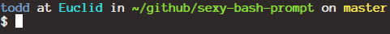
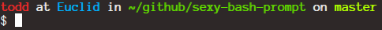

# sexy-bash-prompt [](https://travis-ci.org/twolfson/sexy-bash-prompt)

[Bash][bash] prompt with colors, git statuses, and git branches.

Providing a unique symbol for every combination of a dirty, unpulled, and unpushed `git` branch.

![sexy-bash-prompt screenshot][screenshot]

[screenshot]: screenshot.png

Forked from [a gist by gf3][sexy-bash-orig].

[sexy-bash-orig]: https://gist.github.com/gf3/306785/a35d28b6bdd0f7c54318cce510738438f04dabaa

## Installation
One line install:

```bash
(cd /tmp && git clone --depth 1 https://github.com/twolfson/sexy-bash-prompt && cd sexy-bash-prompt && make install) && source ~/.bashrc
```

### My colors don't look as advertised
If you are seeing a screen like this:



Then, your `TERM` environment variable may never have been configured. Run the script below to prefix our prompt with a `TERM` setup

```bash
cat > /tmp/.bash_prompt_term <<EOF
#!/usr/bin/env bash
# Determine what type of terminal we are using for \`tput\`
if [[ \$COLORTERM = gnome-* && \$TERM = xterm ]]  && infocmp gnome-256color >/dev/null 2>&1; then export TERM=gnome-256color
elif [[ \$TERM != dumb ]] && infocmp xterm-256color >/dev/null 2>&1; then export TERM=xterm-256color
fi

EOF
chmod +x /tmp/.bash_prompt_term
cat ~/.bash_prompt >> /tmp/.bash_prompt_term
cp /tmp/.bash_prompt_term ~/.bash_prompt
rm /tmp/.bash_prompt_term
```

### Manual install
```bash
$ # Clone the repository
$ git clone --depth 1 https://github.com/twolfson/sexy-bash-prompt
Cloning into 'sexy-bash-prompt'...
...
Resolving deltas: 100% (13/13), done.
$ # Go into the directory
$ cd sexy-bash-prompt
$ # Install the script
$ make install
# Copying .bash_prompt to ~/.bash_prompt
cp --force .bash_prompt ~/.bash_prompt
# Adding ~/.bash_prompt to ~/.bashrc
echo ". ~/.bash_prompt" >> ~/.bashrc
# twolfson/sexy-bash-prompt installation complete!
$ # Rerun your ~/.bashrc
$ source ~/.bashrc
todd at Euclid in ~/github/sexy-bash-prompt on master
$ # Your PS1 should now look like this!
```

## Configuration
The styles can be customized by editing `.bash_prompt` directly, or by setting the following environment variables:

- `PROMPT_USER_COLOR` (color for username)
- `PROMPT_PREPOSITION_COLOR` (color for 'at', 'in', 'on')
- `PROMPT_DEVICE_COLOR` (color for machine name)
- `PROMPT_DIR_COLOR` (color for directory)
- `PROMPT_GIT_STATUS_COLOR` (color for git branch and symbol)

You can set colors via [`tput`][] or [ANSI escape codes][]. For example:

[`tput`]: http://en.wikipedia.org/wiki/Tput
[ANSI escape codes]: http://en.wikipedia.org/wiki/ANSI_escape_code

```bash
# Inside your `.bashrc` or `.bash_profile`
PROMPT_USER_COLOR="$(tput bold)$(tput setaf 9)" # BOLD RED
source ~/.bash_prompt
```



## How does it work?
[bash][bash] provides a special set of [variables for your prompts][ps-vars]. `PS1` is the one used by default. The install script adds a command to `~/.bashrc`, a file that is run every time a new terminal opens. Inside of the new command, we run our script and set your `PS1` which runs some `git` commands to determine its current state and outputs them as a string.

[bash]: https://en.wikipedia.org/wiki/Bash_%28Unix_shell%29
[ps-vars]: http://www.gnu.org/software/bash/manual/bashref.html#index-PS1

## Donating
Support this project and [others by twolfson][gittip] via [gittip][].

[![Support via Gittip][gittip-badge]][gittip]

[gittip-badge]: https://rawgithub.com/twolfson/gittip-badge/master/dist/gittip.png
[gittip]: https://www.gittip.com/twolfson/

## Support
Linux and Mac OSX are supported platforms.

Windows is supported to the best of my abilities. However, there have been [font issues][putty-issue] with using [PuTTY][].

[PuTTY]: http://www.chiark.greenend.org.uk/~sgtatham/putty/download.html
[putty-issue]: https://github.com/twolfson/sexy-bash-prompt/issues/7

## Contributing
In lieu of a formal styleguide, take care to maintain the existing coding style. Add unit tests for any new or changed functionality. Test via `make test`.

## License
Copyright (c) 2013 Todd Wolfson

Licensed under the MIT license.
